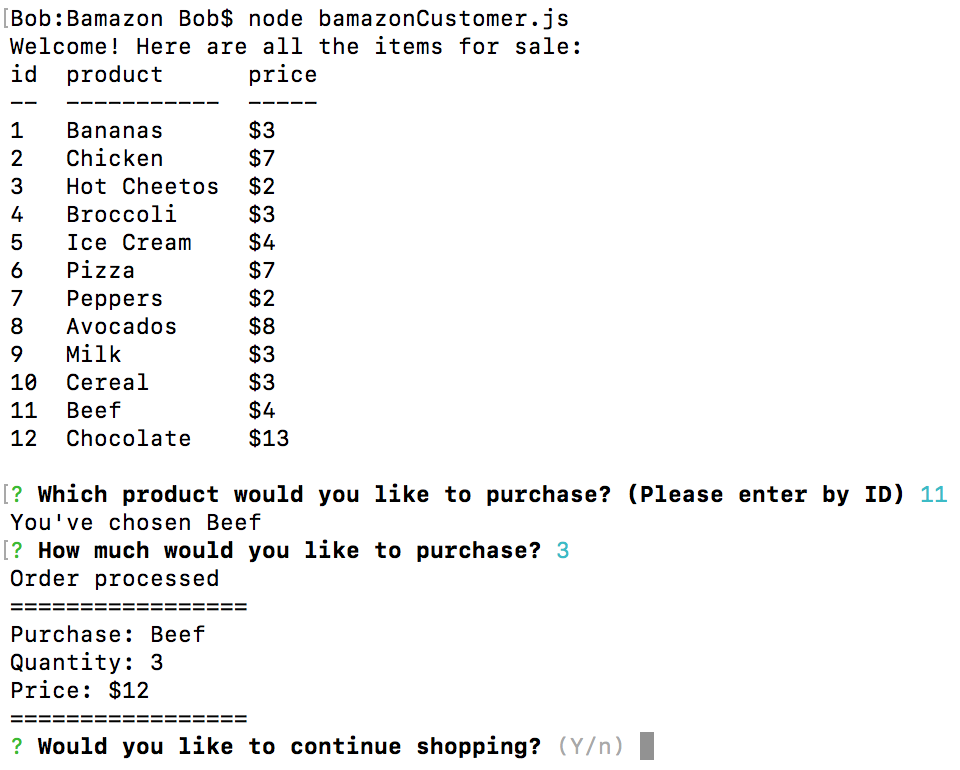

# Bamazon

A command-line Amazon-like app to pracice MySQL queries

## Screenshot

## Preview

## Getting Started

Download the project and install dependencies to get going

### Prerequisites

npm [inquirer](https://www.npmjs.com/package/inquirer)

npm [mysql](https://www.npmjs.com/package/mysql)

npm [console.table](https://www.npmjs.com/package/console.table)

### Technologies Used

Languages - HTML5, CSS3, Javascript, Node.js, MySQL

Text Editor - VS Studio

## Contributing

Please feel free to branch off and make some tweaks and make a PR. Open to any cool suggestions!

## Future Development

* Remember usernames and passwords
* User purchase histories

## Authors

* **Robert Brown** - [Github](https://github.com/robertbernardbrown)
